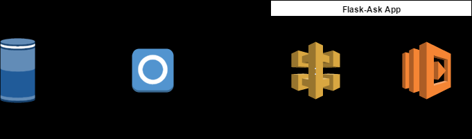

Skip Count Alexa Skill
======================

Skip Count is a simple and interactive Alexa skill aimed at making learning to skip count fun. Skill helps reinforce the concept of counting in increments.

[](https://travis-ci.org/ravishan16/CountByAlexa)[](https://codeclimate.com/github/ravishan16/CountByAlexa)[](https://codeclimate.com/github/ravishan16/CountByAlexa/coverage)[](https://codeclimate.com/github/ravishan16/CountByAlexa)

Architecture
------------

Developing a Custom Skill needs understanding of how Alexa Voice Service ( Interaction Schema, Intents, utterance, custom slots ...) works and how to build a service that can expose the custom skill as an API endpoint. Alexa voice service converts the voice command to a JSON and routes the requests to our custom API. Custom API should accept requests from Alexa Voice Service/Skill and send back response complying to the JSON Contract.



-	[Amazon Developer Blog](https://developer.amazon.com/blogs/post/Tx14R0IYYGH3SKT/Flask-Ask-A-New-Python-Framework-for-Rapid-Alexa-Skills-Kit-Development)
-	[Deploying a Sample Custom Skill as a Web Service](https://developer.amazon.com/public/solutions/alexa/alexa-skills-kit/docs/deploying-a-sample-skill-as-a-web-service)

### Flask-Ask

Flask-Ask is a plugin for flask, a popular Micro-services framework. Flask-Ask makes building the custom skill API a breeze, it abstracts all the heavy lifting and lets you focus on the core code. Flask-Ask validates requests signature (You can turn this off for Testing), maps requests to view functions, construct response complying with the JSON Interface contract and more.

-	[Flask-Ask Reference](https://alexatutorial.com/flask-ask/)
-	[Flask-Ask samples](https://github.com/johnwheeler/flask-ask/tree/master/samples)

### Configuring Skill

Configuring Skill is done in [Amazon Developer Portal](https://developer.amazon.com/). Here you add Skill Information, Interaction Model (Intent Schema, Custom Slots, Sample utterances), Configuration (Mapping the skill to the custom API). Building the Interaction model is the most critical part of building a custom skill.

-	[Big Nerd Ranch Tutorial](https://developer.amazon.com/alexa-skills-kit/big-nerd-ranch)
-	[Registering Skill in Developer Portal](https://developer.amazon.com/alexa) : This step involves configuring skill providing intent schema, sample utterance, custom slots.. and linking to the Flask-Ask API endpoint.

### Deploying Service to AWS

Deploying a flask-ask skill to AWS can be done is so many different ways. IMHO easiest way is to use `ZAPPA` and deploy the app in a server-less way to AWS Lambda and AWS API Gateway.

-	[Deploying Server Less Micro-services using Zappa](https://gun.io/blog/serverless-microservices-with-zappa-and-flask/)
-	[ZappaGit](https://github.com/Miserlou/Zappa)

### Development Practice

1.	Python Version - 2.7
2.	Project Structure - Standard python project structure. [speech_assets](speech_assets/) folder has interaction model assets. Check out [Structuring Guide](http://python-guide-pt-br.readthedocs.io/en/latest/writing/structure/)
3.	Nose tests for Unit Testing - [tests](tests/) folder has the test cases. Understanding JSON interface is critical to writing unit tests for flask-ask app.
4.	Travis CI for build and Code Climate for static code analysis and publishing Test Coverage reports

Testing Flask-Ask App in Local
------------------------------

Clone the repo, cd to the app folder

```shell

git clone git@github.com:ravishan16/CountByAlexa.git
cd CountByAlexa
pip install -r requirements.txt


```

Run app.py launches flask-ask app on http://127.0.0.1:5000/

```python

python countbyalexa/app.py
 * Restarting with stat
 * Debugger is active!
 * Debugger PIN: 145-691-207
 * Running on http://127.0.0.1:5000/ (Press CTRL+C to quit)

```

App exposes one endpoint as POST method. Below curl command to invoke launch intent

```shell

$ curl -X POST \
  http://127.0.0.1:5000/ \
  -H 'cache-control: no-cache' \
  -H 'content-type: application/json' \
  -d '{
    "request": {
        "locale": "en-US",
        "requestId": "amzn1.echo-api.request",
        "timestamp": "2017-04-08T21:53:03Z",
        "type": "LaunchRequest"
    },
    "session": {
        "application": {
            "applicationId": "amzn1.ask.skill"
        },
        "new": true,
        "sessionId": "amzn1.echo-api.session",
        "user": {
            "userId": "amzn1.ask.account"
        }
    },
    "version": "1.0"
}'
```

### Flask-Ask deployment in AWS

1.	Configuring awscli
2.	Setup virtualenv,
3.	Configuring Zappa and runnning deployment

```shell
pip install awscli
aws configure
AWS Access Key ID [None]: XXXX
AWS Secret Access Key [None]: XXXX
Default region name [None]: us-east-1
Default output format [None]: json
```

```shell
virtualenv venv
venv\Scripts\activate
pip install flask-ask zappa awscli
zappa init
zappa deploy dev
```

### Checking Logs

```shell
zappa tail dev
```

### Pushing Update To Code

```shell
zappa update dev
```

Configuration
-------------

The following are set as environment variables in Lambda Function:

MY_USERID & MY_NAME are added to personalize the experience only for the alexa userid added to the environment variable.

-	`LOG_LEVEL`: LOG_LEVEL is set to default `INFO` this can be overridden by adding the env variable.
-	`MY_USERID`: Env variable set to my `Alexa User Id` that comes as part of the request. This is optional.
-	`MY_NAME`: Env variable set to any text\name that will be added as part of the launch intent/ stop intent greeting

License
-------

[MIT](https://github.com/atom/atom/blob/master/LICENSE.md)
